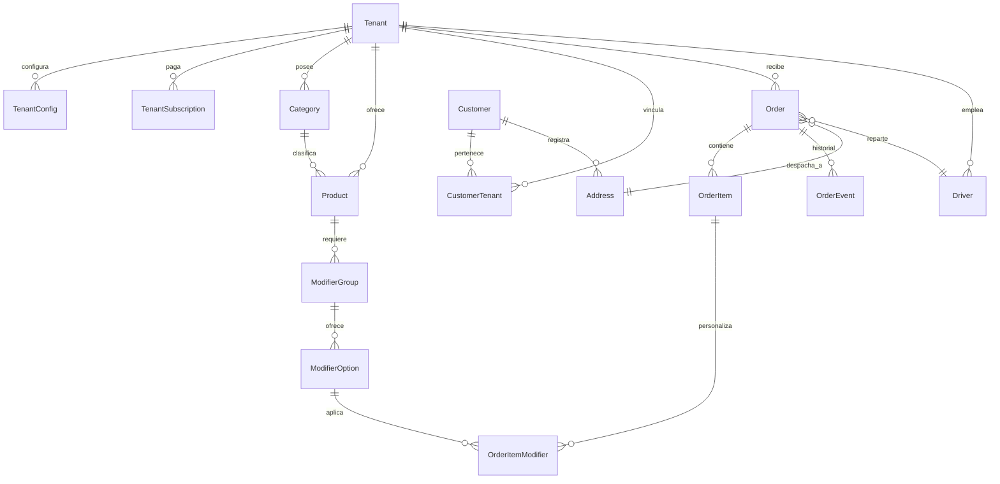

# Especificación: Backend Multi-Tenant & Servidor MCP

Esta especificación describe la arquitectura para transformar el motor de e-commerce y logística local en un backend **SaaS Multi-Tenant** implementado en **FastAPI (Python)**, acompañado de un servidor **MCP (Model Context Protocol)** para permitir que agentes de Inteligencia Artificial (bots de WhatsApp, asistentes de voz, etc.) interactúen directamente con la plataforma.

---

## 1. Arquitectura de Multi-Tenancy

Para dar soporte a múltiples comercios (hamburgueserías, pizzerías, farmacias, tiendas de ropa, etc.) con una única instancia del backend, utilizaremos una estrategia de **aislamiento lógico en base de datos compartida** mediante una columna discriminadora (`tenant_id`). Esto mantiene los costos de infraestructura bajos y simplifica el mantenimiento.

### 1.1 Modelo de Datos (Esquema de Base de Datos Profesional)

Para un SaaS comercial maduro, el modelo de datos debe prever flexibilidad en el catálogo (variantes/agregados), gestión de repartidores propios, y el modelo de negocio del SaaS (suscripción de los comercios).

Cada consulta y operación de escritura sobre las entidades de negocio debe estar estrictamente aislada por el `tenant_id`. Se recomienda crear índices compuestos que incluyan `(tenant_id, id)` o `(tenant_id, fk_col)` para optimizar búsquedas y asegurar el aislamiento lógico a nivel de base de datos.



#### Detalle de Tablas y Atributos Recomendados:

##### 1. Gestión de Tenants y Suscripciones (Core SaaS)
*   **`tenants`** (Comercios registrados en la plataforma)
    *   `id` (UUID, PK)
    *   `slug` (VARCHAR, Unique, Index) — Nombre en URL (ej: `elgusto`, `burgerhouse`).
    *   `name` (VARCHAR) — Nombre comercial.
    *   `status` (ENUM: `ACTIVE`, `SUSPENDED`, `TRIAL`)
    *   `created_at` (TIMESTAMP)
*   **`tenant_configs`** (Ajustes de cada comercio)
    *   `tenant_id` (UUID, FK, PK)
    *   `costo_envio_base` (DECIMAL(10,2))
    *   `envio_gratis_desde` (DECIMAL(10,2), Nullable)
    *   `retiro_disponible` (BOOLEAN, Default: true)
    *   `direccion_local` (VARCHAR)
    *   `horarios_retiro` (VARCHAR)
    *   `campos_entrega` (JSONB) — Configuración dinámica de campos obligatorios en checkout.
    *   `local_coordenadas` (GEOMETRY(Point, 4326), Nullable) — Ubicación GPS del local para calcular radios de entrega.
    *   `mercado_pago_token` (VARCHAR, Nullable) — Token encriptado para Checkout Pro.
*   **`tenant_subscriptions`** (Control de facturación de cada comercio)
    *   `id` (UUID, PK)
    *   `tenant_id` (UUID, FK, Index)
    *   `plan` (ENUM: `BASIC`, `PRO`, `ENTERPRISE`)
    *   `billing_cycle` (ENUM: `MONTHLY`, `YEARLY`)
    *   `expires_at` (TIMESTAMP)
    *   `features` (JSONB) — Banderas para habilitar módulos (ej: bot de IA, repartidores propios).

##### 2. Catálogo Gastronómico y Retail Flexible (Soporta modificadores/variantes)
*   **`categories`** (Categorías de productos)
    *   `id` (UUID, PK)
    *   `tenant_id` (UUID, FK, Index)
    *   `name` (VARCHAR)
    *   `order_index` (INTEGER) — Orden visual en el menú.
*   **`products`** (Productos a la venta)
    *   `id` (UUID, PK)
    *   `tenant_id` (UUID, FK, Index)
    *   `category_id` (UUID, FK)
    *   `name` (VARCHAR)
    *   `description` (TEXT)
    *   `price` (DECIMAL(10,2))
    *   `stock` (INTEGER)
    *   `prep_minutes` (INTEGER) — Tiempo estándar de preparación.
    *   `is_active` (BOOLEAN, Default: true)
*   **`modifier_groups`** (Grupos de agregados/personalización; ej: "Elegí el pan", "Agregados extras")
    *   `id` (UUID, PK)
    *   `tenant_id` (UUID, FK)
    *   `product_id` (UUID, FK, Index)
    *   `name` (VARCHAR) — Ej: "Aderezos".
    *   `min_selectable` (INTEGER) — `0` si es opcional, `1` si es obligatorio.
    *   `max_selectable` (INTEGER) — Límite de opciones a elegir.
*   **`modifier_options`** (Opciones dentro de un grupo)
    *   `id` (UUID, PK)
    *   `group_id` (UUID, FK, Index)
    *   `name` (VARCHAR) — Ej: "Cheddar Extra".
    *   `price_adjustment` (DECIMAL(10,2)) — Costo adicional (ej: `500.00`).
    *   `in_stock` (BOOLEAN, Default: true)

##### 3. Clientes, Direcciones y Repartidores
*   **`customers`** (Clientes a nivel de plataforma)
    *   `id` (UUID, PK)
    *   `phone` (VARCHAR, Unique, Index) — Identificador principal de cero fricción.
    *   `email` (VARCHAR, Nullable, Index)
*   **`customer_tenants`** (Relación inquilino-cliente; historial local)
    *   `tenant_id` (UUID, FK)
    *   `customer_id` (UUID, FK)
    *   `notes` (TEXT, Nullable) — Notas del comercio (ej: "Buen cliente", "Dirección conflictiva").
    *   `loyalty_points` (INTEGER, Default: 0)
    *   PRIMARY KEY (`tenant_id`, `customer_id`)
*   **`addresses`** (Direcciones del cliente)
    *   `id` (UUID, PK)
    *   `customer_id` (UUID, FK, Index)
    *   `etiqueta` (VARCHAR) — Ej: "Casa", "Oficina".
    *   `resumen` (VARCHAR) — Dirección unificada.
    *   `datos` (JSONB) — Datos crudos (calle, número, dpto, coordenadas, etc.).
*   **`drivers`** (Repartidores del comercio)
    *   `id` (UUID, PK)
    *   `tenant_id` (UUID, FK, Index)
    *   `name` (VARCHAR)
    *   `phone` (VARCHAR)
    *   `status` (ENUM: `OFFLINE`, `AVAILABLE`, `BUSY`)

##### 4. Pedidos y Logística Operativa
*   **`orders`** (Pedidos recibidos)
    *   `id` (UUID, PK)
    *   `tenant_id` (UUID, FK, Index)
    *   `customer_id` (UUID, FK, Index)
    *   `address_id` (UUID, FK, Nullable)
    *   `driver_id` (UUID, FK, Nullable) — Asignación de reparto.
    *   `codigo` (VARCHAR, Index) — Código amigable legible (ej: `EGMP-8742`).
    *   `estado` (ENUM: `PENDIENTE`, `CONFIRMADO`, `EN_PREPARACION`, `LISTO`, `EN_REPARTO`, `ENTREGADO`, `CANCELADO`)
    *   `cuando` (ENUM: `ASAP`, `PROGRAMADO`)
    *   `fecha_entrega_estimada` (TIMESTAMP) — Timestamp exacto de cuándo debe entregarse.
    *   `prep_start_time` (TIMESTAMP) — Cuándo debe iniciar la cocina.
    *   `subtotal` (DECIMAL(10,2)), `descuento` (DECIMAL(10,2)), `costo_envio` (DECIMAL(10,2)), `total` (DECIMAL(10,2))
    *   `metodo_pago` (ENUM: `EFECTIVO`, `TRANSFERENCIA`, `MERCADO_PAGO`)
    *   `estado_pago` (ENUM: `PENDIENTE`, `APROBADO`, `RECHAZADO`)
    *   `observaciones` (TEXT, Nullable)
    *   `created_at` (TIMESTAMP)
*   **`order_items`** (Líneas del pedido)
    *   `id` (UUID, PK)
    *   `order_id` (UUID, FK, Index)
    *   `product_id` (UUID, FK)
    *   `quantity` (INTEGER)
    *   `price_at_purchase` (DECIMAL(10,2)) — Histórico del precio en ese momento.
*   **`order_item_modifiers`** (Modificadores seleccionados por el cliente para esa línea)
    *   `id` (UUID, PK)
    *   `order_item_id` (UUID, FK, Index)
    *   `modifier_option_id` (UUID, FK)
    *   `price_adjustment` (DECIMAL(10,2))
*   **`order_events`** (Auditoría e historial de cambios de estado logísticos)
    *   `id` (UUID, PK)
    *   `order_id` (UUID, FK, Index)
    *   `estado` (VARCHAR)
    *   `notes` (TEXT, Nullable)
    *   `created_at` (TIMESTAMP)

### 1.2 Resolución del Tenant en FastAPI

El tenant activo se resolverá dinámicamente en cada petición mediante inyección de dependencias (`Depends` en FastAPI) analizando:
1.  **Subdominio de la petición:** (ej. `hamburguesas.pedidos.com` -> busca tenant con slug `"hamburguesas"`).
2.  **Cabecera personalizada:** (`X-Tenant-ID`) útil para aplicaciones móviles o SPAs.
3.  **API Key en la cabecera de autorización:** (`Authorization: Bearer <api_key>`) usado por integraciones externas y el servidor MCP.

```python
# app/dependencies/tenant.py
from fastapi import Header, HTTPException, Request, Depends
from sqlalchemy.orm import Session
from app.db.session import get_db
from app.models.tenant import Tenant

async def get_current_tenant(request: Request, db: Session = Depends(get_db)) -> Tenant:
    # 1. Intentar por subdominio
    host = request.headers.get("host", "")
    subdomain = host.split(".")[0] if len(host.split(".")) > 2 else None
    
    if subdomain and subdomain not in ("www", "api", "admin"):
        tenant = db.query(Tenant).filter(Tenant.slug == subdomain, Tenant.status == "ACTIVE").first()
        if tenant:
            return tenant
            
    # 2. Intentar por Header X-Tenant-ID
    tenant_id = request.headers.get("X-Tenant-ID")
    if tenant_id:
        tenant = db.query(Tenant).filter(Tenant.id == tenant_id, Tenant.status == "ACTIVE").first()
        if tenant:
            return tenant
            
    raise HTTPException(status_code=400, detail="Tenant context missing or inactive")
```

---

## 2. Especificación del Servidor MCP

El **Model Context Protocol (MCP)** es un estándar abierto que permite a los clientes de IA (como Claude, asistentes conversacionales, etc.) consumir herramientas y recursos provistos por un servidor. 

Al exponer la lógica de nuestro backend mediante un Servidor MCP, un Agente de IA (como un bot de WhatsApp operando con LLMs) puede charlar en lenguaje natural con el cliente y usar las herramientas del MCP para automatizar la venta.

### 2.1 Herramientas Expuestas (Tools)

El servidor MCP expondrá las siguientes herramientas esenciales, autenticadas con la API Key del comercio (`tenant_id` implícito en la sesión de la API Key):

#### 1. `get_catalog`
*   **Descripción:** Consulta la lista de productos disponibles organizados por categoría.
*   **Parámetros:**
    *   `category_id` (opcional, string): Filtrar por categoría específica.
    *   `only_in_stock` (opcional, boolean, default: `true`): Ocultar productos sin stock.
*   **Salida (JSON):**
    ```json
    [
      {
        "id": "prod_123",
        "nombre": "Cheesecake de Frutos Rojos",
        "descripcion": "Porción individual con salsa artesanal",
        "precio": 4500.0,
        "stock": 14,
        "prep_minutos": 10,
        "categoria": "Postres"
      }
    ]
    ```

#### 2. `check_product_stock`
*   **Descripción:** Consulta el stock exacto y el tiempo estimado de preparación para una lista de productos y cantidades específicas.
*   **Parámetros:**
    *   `items` (array de objetos): Lista de `{ product_id: string, cantidad: integer }`.
*   **Salida (JSON):**
    ```json
    {
      "disponible": true,
      "stock_suficiente": true,
      "prep_minutos_total": 25,
      "detalles": [
        { "product_id": "prod_123", "stock_actual": 14, "requerido": 2, "ok": true }
      ]
    }
    ```

#### 3. `lookup_customer`
*   **Descripción:** Busca a un cliente por su número de teléfono. Si existe, devuelve sus datos básicos y la lista de direcciones guardadas.
*   **Parámetros:**
    *   `telefono` (string, requerido): Número de teléfono o WhatsApp del cliente (ej. `5492281400000`).
*   **Salida (JSON):**
    ```json
    {
      "encontrado": true,
      "nombre": "Sofia Gonzalez",
      "email": "sofia@gmail.com",
      "direcciones": [
        {
          "id": "addr_999",
          "etiqueta": "Trabajo",
          "resumen": "Av. Mitre 1234, Piso 1, Dpto B",
          "datos": {
            "calle": "Av. Mitre",
            "numero": "1234",
            "piso": "1",
            "departamento": "B"
          }
        }
      ]
    }
    ```

#### 4. `create_order`
*   **Descripción:** Registra un nuevo pedido en el sistema, calculando los precios finales en el servidor, validando stock y agendando la entrega.
*   **Parámetros:**
    *   `nombre_cliente` (string, requerido)
    *   `telefono_cliente` (string, requerido)
    *   `email_cliente` (string, opcional)
    *   `metodo_entrega` (enum: `ENVIO`, `RETIRO`, requerido)
    *   `direccion_id` (string, opcional): ID de una dirección guardada.
    *   `direccion_nueva` (objeto, opcional): Datos para crear una nueva dirección según el esquema dinámico del tenant.
    *   `zona_envio` (string, requerido si metodo_entrega es `ENVIO`)
    *   `cuando` (enum: `ASAP`, `PROGRAMADO`, requerido)
    *   `fecha_entrega` (string, formato YYYY-MM-DD, requerido si es `PROGRAMADO`)
    *   `hora_entrega` (string, formato HH:MM, requerido si es `PROGRAMADO`)
    *   `metodo_pago` (enum: `MERCADO_PAGO`, `TRANSFERENCIA`, `EFECTIVO`, requerido)
    *   `items` (array de objetos, requerido): Lista de `{ product_id: string, cantidad: integer }`
    *   `observaciones` (string, opcional): Notas adicionales del pedido.
*   **Salida (JSON):**
    ```json
    {
      "success": true,
      "codigo_pedido": "EGMP-8742",
      "total": 12500.0,
      "pago_requerido": true,
      "checkout_url": "https://www.mercadopago.com.ar/sandbox/showcase/...",
      "estado": "PENDIENTE",
      "fecha_entrega_estimada": "2026-07-15T12:30:00Z"
    }
    ```

#### 5. `get_order_status`
*   **Descripción:** Obtiene el estado operativo en tiempo real de un pedido mediante su código alfanumérico.
*   **Parámetros:**
    *   `codigo_pedido` (string, requerido): El código único del pedido (ej: `EGMP-8742`).
*   **Salida (JSON):**
    ```json
    {
      "codigo": "EGMP-8742",
      "estado": "EN_PREPARACION",
      "estado_pago": "APROBADO",
      "metodo_entrega": "ENVIO",
      "total": 12500.0,
      "tiempo_estimado_despacho": "2026-07-15T12:15:00Z",
      "eventos": [
        { "estado": "EN_PREPARACION", "fecha": "2026-07-15T11:45:00Z" },
        { "estado": "CONFIRMADO", "fecha": "2026-07-15T11:40:00Z" }
      ]
    }
    ```

---

## 3. Ejemplo de Flujo Conversacional usando MCP

Un agente de IA integrado en WhatsApp funcionaría de la siguiente manera ante un cliente:

1.  **Saludo y Consulta de Menú:**
    *   *Cliente:* "Hola, ¿qué tenés para comer hoy?"
    *   *Agente (IA) ejecuta:* `get_catalog()`
    *   *Agente responde:* "¡Hola! Hoy tenemos Cheesecakes de Frutos Rojos ($4500), Budines de Limón ($3200) y Alfajores de Pistacho ($1500). ¿Qué te gustaría tentar?"
2.  **Armado del Pedido:**
    *   *Cliente:* "Quiero 2 Cheesecakes por favor. ¿Hacen envíos?"
    *   *Agente (IA) ejecuta:* `check_product_stock(items=[{"product_id": "cheesecake_id", "cantidad": 2}])` y verifica el `TenantConfig` (para confirmar si hay envíos activos).
    *   *Agente responde:* "¡Perfecto, tenemos stock! Sí, hacemos envíos. ¿Me pasás tu número de teléfono para ver si ya tenemos cargada tu dirección?"
3.  **Identificación del Cliente:**
    *   *Cliente:* "Es el 2281401234"
    *   *Agente (IA) ejecuta:* `lookup_customer(telefono="2281401234")`
    *   *Agente responde:* "¡Te encontré, Sofía! ¿Querés que te lo enviemos a tu dirección habitual en 'Av. Mitre 1234, Piso 1, Dpto B'?"
4.  **Confirmación y Pago:**
    *   *Cliente:* "Sí, a esa misma."
    *   *Agente (IA) ejecuta:* `create_order(nombre_cliente="Sofia Gonzalez", telefono_cliente="2281401234", metodo_entrega="ENVIO", direccion_id="addr_999", metodo_pago="MERCADO_PAGO", items=[{"product_id": "cheesecake_id", "cantidad": 2}])`
    *   *Agente responde:* "¡Excelente! Tu pedido **EGMP-8742** ya fue registrado. Para confirmarlo, podés realizar el pago de $9000 (envío incluido) en este enlace de Mercado Pago: [Pagar Pedido](https://link-de-pago...). Una vez abonado, ¡empezamos a prepararlo!"
