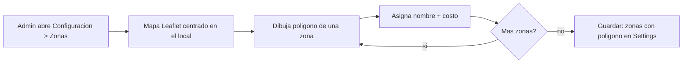
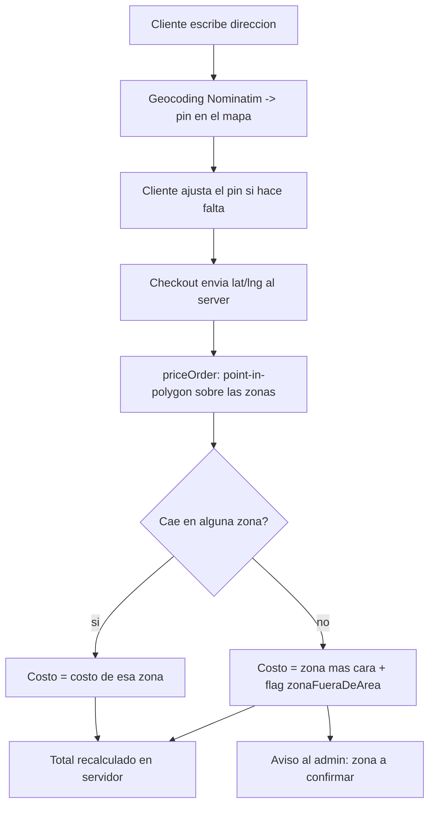

# Especificación: Zonas de Reparto por Polígono (mapa dibujable)

Esta especificación describe cómo reemplazar la **selección manual de zona por parte del
cliente** por una **detección automática basada en la ubicación real** de la dirección de
entrega. El administrador dibuja las zonas sobre un mapa de la ciudad (polígonos), les asigna
un costo, y el sistema determina en qué zona cae cada pedido calculando *point-in-polygon* en
el servidor.

> Estado: **spec / no implementado todavía.** Este documento es la referencia para cuando se
> encare el desarrollo.

---

## 1. Objetivo

- El cliente **ya no elige** la zona de reparto en el checkout.
- El costo de envío se deriva de **dónde está** la dirección, no de lo que el cliente declara.
- El admin gestiona las zonas de forma visual: **dibuja polígonos** sobre el mapa de la ciudad
  y a cada uno le pone un nombre y un costo.
- Todo el cálculo de costo sigue ocurriendo **en el servidor** (`priceOrder`), respetando la
  convención del repo de nunca confiar en el cliente.

---

## 2. Decisiones tomadas

| Tema | Decisión |
|------|----------|
| Proveedor de mapas | **Leaflet + OpenStreetMap.** Gratis, sin API key ni tarjeta. Tiles de OSM, dibujo de polígonos con `leaflet-draw` (o equivalente), geocoding con **Nominatim** (OSM). Encaja con la filosofía del repo de "degradar con elegancia sin credenciales". |
| Geocoding | Nominatim para autocompletar desde la dirección escrita, **más un pin ajustable** por el cliente para corregir imprecisiones (clave en un pueblo como Benito Juárez). |
| Fuera de zona | **Se cobra el envío más caro** (la zona de mayor `costo` configurada) **y se marca el pedido para que el admin lo confirme.** Se asume que una dirección fuera de todos los polígonos está lejos. La compra **no se bloquea**. |
| Cálculo de pertenencia | *Ray casting* puro en el servidor, sin dependencias nuevas de backend. |

---

## 3. Estado actual (lo que hay que cambiar)

### 3.1 Modelo de zona — plano, sin geometría
`src/domain/settings.ts`:
```ts
export type DeliveryZone = {
  nombre: string;
  costo: number;
};
```
Las zonas viven dentro del JSON de `Setting["negocio"]` (`zonas: DeliveryZone[]`), junto al
resto de la configuración del negocio. Valores por defecto en `DEFAULT_SETTINGS.zonas`.

### 3.2 El cliente elige la zona
`src/components/shop/checkout/checkout-form.tsx`:
- Estado local `zona` (línea ~64), inicializado a `s.zonas[0]`.
- Un `<Select>` "Zona de reparto" (línea ~356) donde el cliente elige.
- Se envía `zona` (nombre) en `createOrderAction` (línea ~224).

### 3.3 El servidor busca el costo por nombre
`src/data/orders.ts` → `priceOrder` (línea ~59):
```ts
if (input.metodoEntrega === "ENVIO") {
  const zona = settings.zonas.find((z) => z.nombre === input.zona);
  costoEnvioBruto = zona?.costo ?? settings.costoEnvioBase;
}
```

### 3.4 A favor: ya existen campos de geo
- `Address.lat` / `Address.lng` (`prisma/schema.prisma` ~268) **ya existen** pero hoy no se
  llenan. Los vamos a usar.
- `BusinessSettings.localLat` / `localLng` ya guardan la ubicación del local (útil para centrar
  el mapa y, a futuro, para cálculo por distancia real).

---

## 4. Cambios de modelo de datos

### 4.1 `DeliveryZone` con polígono
`src/domain/settings.ts`:
```ts
export type LatLng = { lat: number; lng: number };

export type DeliveryZone = {
  id: string;            // estable, para reordenar/editar sin ambigüedad
  nombre: string;
  costo: number;
  poligono: LatLng[];    // anillo cerrado (el primer y último punto se asumen unidos)
  color?: string;        // color de dibujo en el mapa del admin (opcional)
};
```
- Sigue viviendo en el JSON de settings → **no requiere migración de Prisma** para las zonas.
- Retrocompat: zonas viejas sin `poligono` se tratan como "sin geometría" y se ignoran en la
  detección automática (sólo cuentan las que tienen polígono). Conviene un fallback de datos
  al leer settings.

### 4.2 Snapshot de zona y flag "a confirmar" en el pedido
Requiere **migración de Prisma** (modelo `Order`):
```prisma
model Order {
  // ...
  zonaNombre       String?   // snapshot del nombre de zona detectada
  zonaFueraDeArea  Boolean   @default(false) // true si no cayó en ningún polígono
  // lat/lng de entrega: usar Address.lat / Address.lng (ya existen)
}
```
- `zonaNombre`: para mostrar en el backoffice sin recomputar.
- `zonaFueraDeArea`: dispara el aviso al admin y el badge "zona a confirmar".

### 4.3 Poblar `Address.lat` / `Address.lng`
En `createOrder` (`src/data/orders.ts` ~173), al crear la `Address`, guardar el `lat`/`lng`
que venga del pin del checkout.

---

## 5. Componentes a construir

### 5.1 Backoffice — Editor de zonas con mapa
Ubicación: sección **Configuración** (junto a `settings-form.tsx`), pestaña "Envíos / Zonas".

- Mapa Leaflet centrado en `localLat/localLng` con tiles de OSM.
- Herramienta de dibujo de polígonos (`leaflet-draw` o `react-leaflet` + plugin):
  - Dibujar nuevo polígono → crea una zona.
  - Editar vértices / mover / borrar.
  - Por cada zona: input de **nombre**, **costo**, y color.
- Listado lateral de zonas con su costo; resaltar en el mapa al hover.
- Guardar: serializa `zonas: DeliveryZone[]` (con polígonos) y lo persiste vía la server action
  de settings existente (`requireAdmin()` primero, como toda action de admin).

**Notas técnicas:**
- Leaflet toca `window`, así que el componente del mapa debe ser **client component** y cargarse
  con `next/dynamic` (`{ ssr: false }`). Aplica tanto al editor del admin como al mini-mapa del
  checkout.
- CSS de Leaflet: importar `leaflet/dist/leaflet.css`.
- Turbopack: verificar que los assets de íconos de Leaflet (marker) resuelvan bien; suele
  requerir configurar `iconUrl` manualmente.

### 5.2 Checkout — pin + geocoding, sin selector de zona
`src/components/shop/checkout/checkout-form.tsx`:
- **Eliminar** el `<Select>` "Zona de reparto" y el estado `zona`.
- Al completar calle/número/ciudad, llamar a **Nominatim** para geocodear → centrar el mapa y
  poner un pin.
- Mini-mapa con **pin arrastrable** para que el cliente ajuste la ubicación exacta. El `lat/lng`
  final se envía en el payload de `createOrderAction` (nuevos campos, ej. `entregaLat`,
  `entregaLng`).
- Mostrar de forma **informativa** la zona/costo detectados (recalculado por el server preview),
  sin permitir editarlos.

**Respeto Nominatim (uso gratuito):**
- Rate limit de 1 req/seg; agregar *debounce* al geocoding.
- Enviar `User-Agent`/`Referer` identificando la app (lo pide su política de uso).
- Considerar cachear resultados por dirección normalizada.
- Para volumen alto, evaluar self-host de Nominatim más adelante (fuera de alcance de v1).

### 5.3 Servidor — detección de zona (point-in-polygon)
Nuevo módulo `src/domain/geo.ts` (puro, testeable, sin dependencias):
```ts
// Ray casting. punto y polígono en {lat,lng}.
export function pointInPolygon(p: LatLng, ring: LatLng[]): boolean { /* ... */ }

// Devuelve la primera zona cuyo polígono contiene el punto, o null.
export function zonaParaPunto(p: LatLng, zonas: DeliveryZone[]): DeliveryZone | null { /* ... */ }
```

Integración en `priceOrder` (`src/data/orders.ts`), reemplazando el lookup por nombre:
```ts
if (input.metodoEntrega === "ENVIO") {
  const punto = input.entregaLat != null && input.entregaLng != null
    ? { lat: input.entregaLat, lng: input.entregaLng }
    : null;

  const zona = punto ? zonaParaPunto(punto, settings.zonas) : null;

  if (zona) {
    costoEnvioBruto = zona.costo;
    zonaNombre = zona.nombre;
    zonaFueraDeArea = false;
  } else {
    // Fuera de todas las zonas → se cobra la más cara y se marca para confirmar.
    const masCara = settings.zonas.reduce(
      (max, z) => (z.costo > max ? z.costo : max),
      settings.costoEnvioBase,
    );
    costoEnvioBruto = masCara;
    zonaNombre = null;
    zonaFueraDeArea = true;
  }
}
```
El resultado (`zonaNombre`, `zonaFueraDeArea`) se propaga a `createOrder` y se persiste en el
pedido.

### 5.4 Aviso al admin (fuera de zona)
- **Backoffice:** en la lista de pedidos y en el detalle, badge **"Zona a confirmar"** cuando
  `zonaFueraDeArea === true`. En el detalle de pedido
  (`src/app/admin/(panel)/pedidos/[codigo]/page.tsx`) mostrarlo junto a la dirección.
- **Notificación:** reutilizar el canal de notificaciones existente (el spec multi-tenant
  menciona un notifier / webhooks; en el estado actual, al menos email vía Resend si hay
  credenciales, y/o el mensaje de WhatsApp) para avisar que entró un pedido fuera de área.

---

## 6. Flujos

### 6.1 Admin define zonas


### 6.2 Cliente hace un pedido con envío


---

## 7. Casos borde y consideraciones

- **Dirección sin geocodificar / sin pin:** si no llega `lat/lng` (Nominatim falló y el cliente
  no marcó pin), no se puede detectar zona. Opciones: exigir el pin antes de continuar, o tratar
  como fuera de zona (costo más caro + confirmar). **Recomendado:** pedir el pin.
- **Polígonos solapados:** `zonaParaPunto` devuelve la **primera** coincidencia. El orden de
  `zonas` define prioridad; permitir reordenar en el editor.
- **Polígono inválido** (menos de 3 vértices): validar al guardar en el admin.
- **Retiro en local:** sin cambios; no aplica zona.
- **Zonas legacy sin polígono:** se ignoran en detección; conviene una migración de datos que
  las convierta o las marque.
- **Precisión de Nominatim en pueblos chicos:** por eso el pin ajustable es obligatorio en la UX.
- **Costo de envío gratis:** `envioGratisDesde` sigue aplicando después de resolver el costo de
  zona (la lógica de `computeCart` no cambia).

---

## 8. Fases de implementación sugeridas

1. **Modelo:** extender `DeliveryZone` con `poligono`; migración de `Order`
   (`zonaNombre`, `zonaFueraDeArea`); poblar `Address.lat/lng`.
2. **Servidor:** `src/domain/geo.ts` (point-in-polygon) + integrar en `priceOrder` con el
   fallback "más cara + flag". Tests unitarios de `pointInPolygon`.
3. **Backoffice:** editor de zonas con mapa Leaflet (dibujo de polígonos + costo).
4. **Checkout:** quitar el `<Select>` de zona; agregar geocoding Nominatim + pin ajustable;
   enviar `lat/lng`.
5. **Avisos:** badge "zona a confirmar" en backoffice + notificación al admin.
6. **Datos:** migración/limpieza de zonas legacy sin polígono.

---

## 9. Dependencias nuevas (frontend)

- `leaflet` + tipos (`@types/leaflet`).
- Dibujo: `leaflet-draw` (o `react-leaflet` + `react-leaflet-draw`, evaluar compatibilidad con
  React 19 / Next 16 / Turbopack).
- **Sin** dependencias de geocoding: Nominatim se consume por `fetch` a su endpoint HTTP.
- **Sin** dependencias de backend para geometría: el ray casting es propio en `src/domain/geo.ts`.
